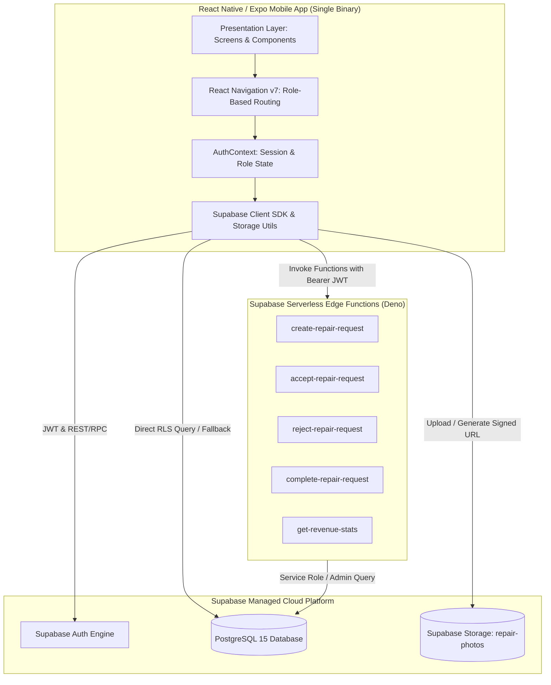
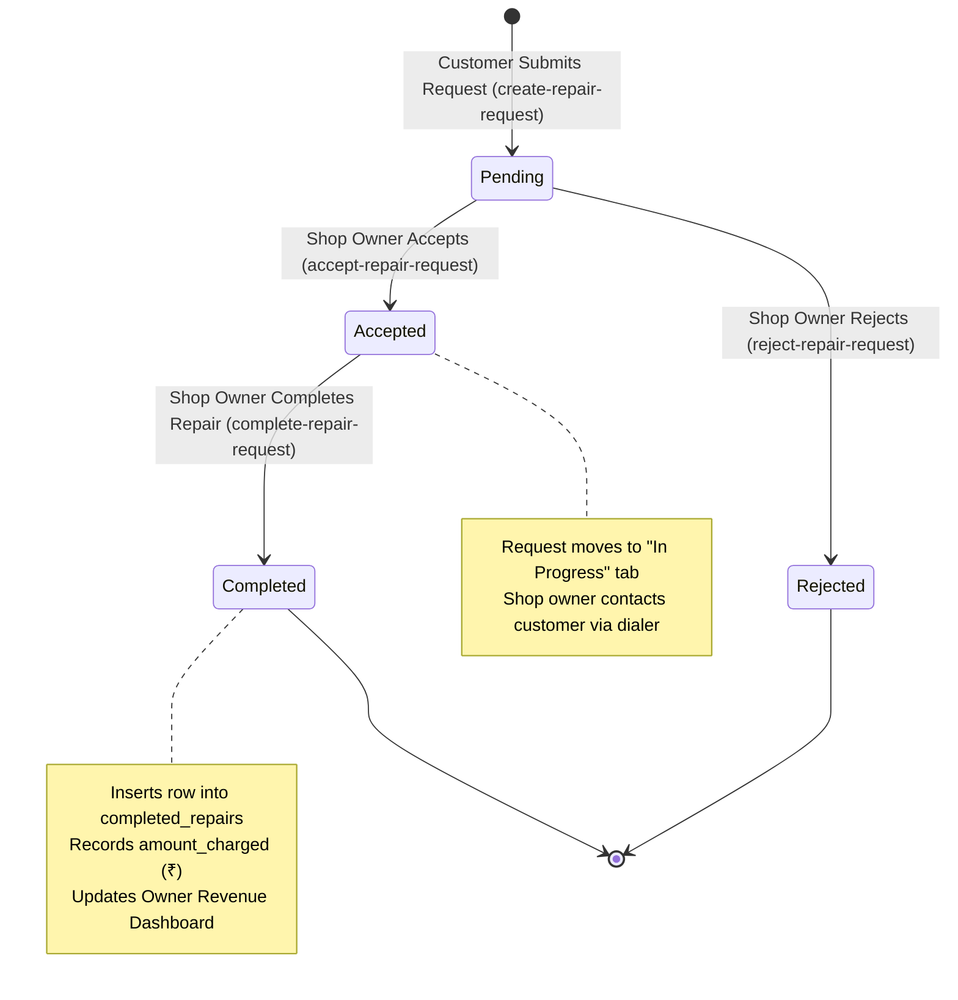

# Mob Dr — System Architecture

This document details the architectural design, component layers, data flows, and security model of the **Mob Dr** doorstep phone repair mobile application.

---

## 1. High-Level Architecture Overview



---

## 2. Architectural Layers

### 2.1. Client Presentation Layer
- **Framework**: React Native `0.86.3` managed via Expo `~57.0.18`.
- **Navigation Engine**: React Navigation v7 with strict TypeScript parameter typing (`src/types/index.ts`).
  - `AppNavigator`: Root state observer routing between `AuthStack`, `CustomerStack`, and `ShopOwnerStack`.
  - `CustomerNavigator`: Bottom-tab navigator (`CustomerHomeScreen`, `NewRequestScreen`) and parent stack containing `RequestDetailScreen`.
  - `ShopOwnerNavigator`: Bottom-tab navigator (`IncomingRequestsScreen`, `OwnerDashboardScreen`) and parent stack containing `OwnerRequestDetailScreen`.
- **Design Tokens & Components**:
  - Uber-inspired black-and-white visual identity (`#FFFFFF` background, `#000000` interactive elements, `#666666` secondary text).
  - Visual-first input pattern: `IconGridSelector` with custom SVG outline brand logos for 12 Indian smartphone brands (`BrandLogos.tsx`) and problem category icons.

### 2.2. State Management & Authentication Context
- **Central Context (`AuthContext`)**:
  - Maintains `session`, `user` (profile from `public.users`), and `role` (`customer` | `shop_owner`).
  - Subscribes to `supabase.auth.onAuthStateChange` to dynamically mount or dismount navigation stacks upon login or logout.
  - Automatically loads and caches authenticated profile metadata using `@react-native-async-storage/async-storage`.
- **Dual Identifier Resolution**:
  - Seamlessly handles email and phone number inputs. Phone numbers invoke the PostgreSQL RPC `get_email_for_phone` to lookup the corresponding auth email before executing `signInWithPassword`.

### 2.3. Serverless Compute Layer (Edge Functions)
All business operations involving role enforcement and financial aggregation execute via Supabase Edge Functions (Deno / TypeScript):

| Function Name | Caller Role | Primary Responsibility |
|---|---|---|
| `create-repair-request` | `customer` | Validates device parameters, inserts the request, and binds photo URLs. |
| `accept-repair-request` | `shop_owner` | Transitions status from `pending` to `accepted`. |
| `reject-repair-request` | `shop_owner` | Transitions status from `pending` to `rejected`. |
| `complete-repair-request` | `shop_owner` | Sets status to `completed`, inserts row into `completed_repairs` with `amount_charged`. |
| `get-revenue-stats` | `shop_owner` | Aggregates revenue for This Month, Last Month, All Time, and monthly chart intervals. |

### 2.4. Data & Persistence Layer (PostgreSQL)
The PostgreSQL database runs with Row-Level Security (RLS) enabled on all tables:
- **`users`**: Profile table mirroring `auth.users` via triggers (`handle_new_user`).
- **`repair_requests`**: Stores repair orders, device brands, problem descriptions, and statuses.
- **`repair_photos`**: Relational junction connecting uploaded image paths to repair requests.
- **`completed_repairs`**: Financial record tracking completed jobs, dates, and amounts charged (in INR ₹).

### 2.5. Media & Storage Layer
- **Bucket**: `repair-photos` (private).
- **Access Pattern**: Photos are uploaded directly to `{userId}/{timestamp}_{random}.jpg` using the client SDK.
- **Delivery**: The application never serves raw public URLs. All image rendering utilizes **time-limited signed URLs** (`getSignedPhotoUrl` with 3600-second TTL), preventing unauthorized public access to customer device photos.

---

## 3. Request Lifecycle State Machine



---

## 4. Security & Access Control Model

The application employs a **defense-in-depth** security strategy:

```
[Layer 1: Client Navigation Routing]
  └── AppNavigator inspects AuthContext.role. Screens for opposite role are never mounted.

[Layer 2: Serverless Function JWT Authorization]
  └── Edge Functions inspect the Authorization: Bearer <token> header, extract the caller's UUID,
      and verify that users.role matches the required permissions before running logic.

[Layer 3: PostgreSQL Row-Level Security (RLS)]
  └── Database tables reject unauthorized queries at the database engine level:
      - Customers can only SELECT/INSERT their own repair requests.
      - Shop owners can SELECT all requests, UPDATE status, and manage completed_repairs.

[Layer 4: Storage Bucket Security Policies]
  └── Storage bucket 'repair-photos' requires authentication for uploads and serves private
      files exclusively via time-limited signed URLs.
```

---

## 5. Resilient Fallback Pattern

To guarantee high availability when operating on cellular connections during home visits:
1. **Edge-First Execution**: The client prioritizes calling the relevant Edge Function for state changes.
2. **Graceful Database Fallback**: If an Edge Function experiences a timeout or network glitch, client screens have built-in fallbacks to perform direct database updates guarded strictly by Row-Level Security (RLS).
3. **Optimistic State Updates**: Local React component state updates immediately upon action confirmation to prevent UI lag.
